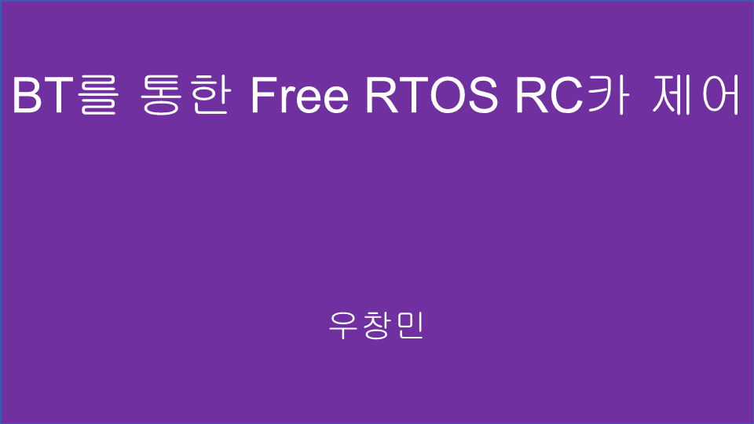
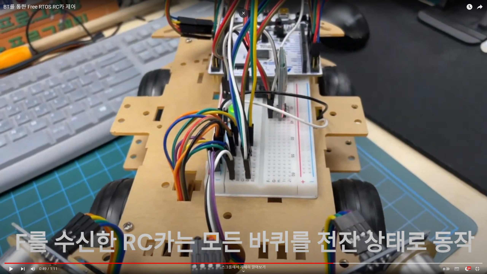

# STM32_AUTONOMOUS_CAR

 AUTONOMOUS CAR based on STM32F411 Free RTOS
 

## Contents:
 - [결과물](#output)
   

## Outline
프로젝트 주제: STM32F411 Free RTOS 기반 다양한 HW 모듈을 활용한 자율주행차  
 
프로젝트 수행자: 인텔 엣지AI SW개발자 아카데미 3기 우창민 
 
프로젝트 수행기간: 24/03/10 ~ 24/03/12 

 
 

## Output

 

## Presentation

아래 사진을 누르면 데모 영상 링크로 이동합니다.
 

## Demo Vedio

아래 사진을 누르면 데모 영상 링크로 이동합니다.
 

[맨 위로](#top)
